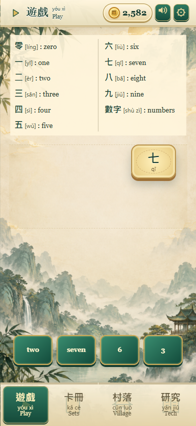
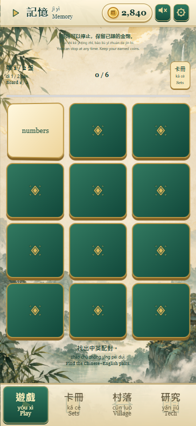
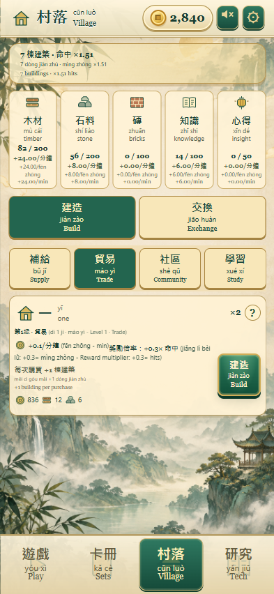
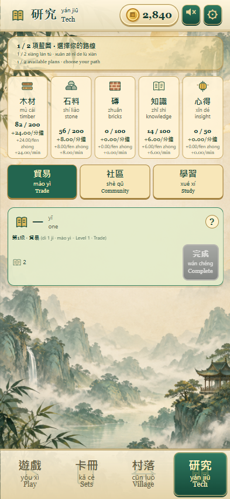

# Chinese Village

A phone-sized incremental game where Chinese–English puzzles earn coins to grow a village. Start with numbers, build a vocabulary through short battles, matching, memory cards and sentence ordering, then invest your earnings in buildings and research.

Buildings produce resources and improve puzzle rewards. New journeys require buildings owned, completed research and resource stockpiles. Prestige resets the village and lesson progress for a stronger earnings multiplier and another round of familiar vocabulary.

The game includes traditional/simplified Chinese, configurable pinyin and English hints, recorded male/female speech, offline production and local browser saves. The playable campaign contains 25 core vocabulary levels, two resource-vocabulary stages and eight sentence stages.

## Screenshots

Current `game-v1` interface, captured with example progress at 393 × 852 pixels.

| Battle | Memory |
| --- | --- |
|  |  |

| Village | Research |
| --- | --- |
|  |  |

## Run locally

From the project root:

```sh
python -m http.server 8765 --bind 127.0.0.1
```

Open [the game](http://127.0.0.1:8765/game-v1/index.html). No build step is required. Phones use the available screen; desktop browsers show a phone-sized canvas. Progress is stored in the browser's local storage.

## Folders

| Folder | Contents |
| --- | --- |
| `game-v1/` | Current playable game; `index.html` contains the screens and reusable HTML templates. |
| `game-v1/modes/` | Battle, matching, memory, bonus and sentence-order interactions. |
| `game-v1/systems/` | Village economy, research and progression-related rules. |
| `game-v1/ui/` | Screen updates, shared labels and help rendering. |
| `game-v1/data/` | JSON definitions for buildings, research, resources, progression and UI vocabulary. |
| `game-v1/lessons/` | Campaign manifest and individual language-level JSON files. |
| `game-v1/assets/` / `audio/` | Backgrounds, sprite sheets, icons and bundled speech. |
| `game-v1/scripts/` / `tests/` | Content/asset generation and automated checks. |
| `docs/` | HSK mappings, earlier design documents and README screenshots. |
| `output/` | Earlier visual concepts and prototypes. |

See the [game development README](game-v1/README.md) for implementation details and [current level requirements](game-v1/PROGRESSION.md) for the advancement table. Earlier design documents may differ from the playable version.

## Checks

```sh
node --test game-v1/tests/*.test.mjs
```

Browser checks use Playwright with Microsoft Edge and the local server running. This is a browser prototype; the economy and campaign pacing are still being tuned.
